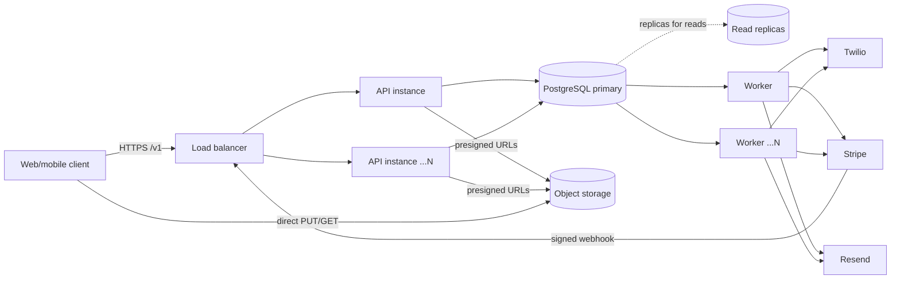
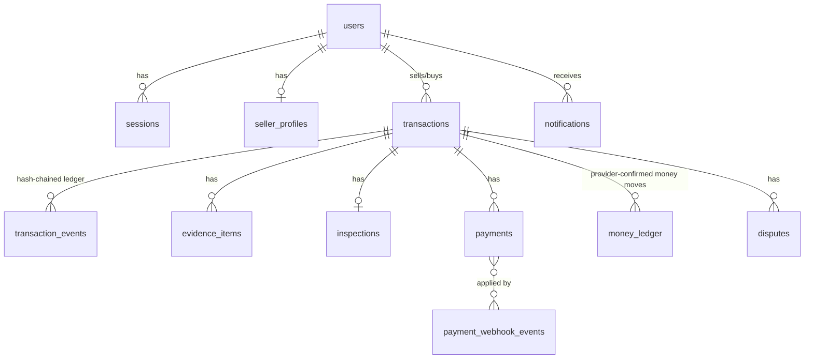

# Evidence Trust — Architecture

> Core principle: **create a verifiable evidence trail from agreement to resolution.** Escrow is a feature of the trail, not the product.

## 1. Repository inspection

The repository was empty (README + .gitignore). Greenfield. Local toolchain: Node 24, npm 11, git. No Docker/psql locally,
so tests run against **PGlite (real Postgres compiled to WASM)** behind the same `Db` interface the production `pg` pool implements;
CI additionally applies migrations on a real Postgres 16 service.

## 2. Final architecture

A **modular monolith** with a separate **worker process**, one codebase, one image, three roles. Modules have strict boundaries and
can be extracted into services later without changing contracts, because cross-module effects already flow through the transactional outbox.

Key decisions (and why):

| Decision | Rationale |
|---|---|
| TypeScript strict, Node 22 | Type safety end-to-end; one language for API/worker/future web |
| Fastify 5 + zod | Fast, schema-validated at the edge; low overhead |
| PostgreSQL as system of record **and** queue | Money/evidence need transactional consistency. A transactional outbox (`jobs`, `FOR UPDATE SKIP LOCKED`) means a state change and its side-effects commit atomically. Avoids dual-write bugs. Migrate to SQS/Kafka behind `enqueue()` when throughput demands |
| Evidence bytes never touch the API | Presigned direct-to-S3 upload (enforced size + SHA-256), so large video scales independently |
| Hash-chained append-only event ledger | Tamper-evidence: every event's hash covers the previous hash; DB triggers forbid UPDATE/DELETE |
| Stripe (Connect) as first provider, raw HTTPS | Licensed provider holds funds; we never hold money. No SDK = fewer deps, explicit verification code |
| Opaque server-side sessions | Instant revocation (suspension), no JWT pitfalls; Bearer header => no CSRF surface |

## 3. Dependency map

`app.ts` → `modules/*` → `domain/stateMachine` , `modules/ledger` , `jobs/queue` → `db/db`.
`modules` depend on `providers/types` (interfaces) only; concrete adapters (`stripe`, `s3`, `messaging`) are wired in `bootstrap.ts`.
`jobs/handlers` depend on `modules` + provider interfaces. Nothing depends on `app.ts`.

## 4. Service boundaries

| Module | Owns | Emits (outbox) |
|---|---|---|
| auth | users, sessions, auth_tokens | verify-email notification |
| transactions | transactions, transaction_events (ledger), inspections, disputes | notifications, payout/refund jobs |
| evidence | evidence_items + object storage keys | `evidence.recorded` ledger events |
| payments | payments, payment_webhook_events, money_ledger | `webhook.process` |
| notifications | notifications | `notification.send` |
| admin/ops | audit_log, job inspection | — |

Extraction order if needed: notifications → payments → evidence.

## 5. Database / ERD

Invariants enforced **in the database**: one open dispute per transaction; one live payment attempt per transaction; unique webhook
event ids; unique money-ledger entries; append-only `transaction_events`, `money_ledger`, `audit_log`; buyer ≠ seller; money in integer minor units.

Scale path: partition `transaction_events`/`audit_log` by time; read replicas for timelines; PgBouncer in front of the pool;
move `jobs` to a dedicated queue when >~1–2k jobs/s.

## 6. State machine (single source: `domain/stateMachine.ts`)

`awaiting_agreement → agreed → condition_documented → awaiting_payment → funded → dispatched → delivered → inspected → completed`
with `dispute.opened` from `dispatched|delivered|inspected` → `disputed → resolved`, and `cancelled` before payment.
Every transition names the permitted actor (buyer/seller/system/arbiter) and writes a ledger event.
Gates: condition evidence before payment; dispatch evidence before dispatch; unboxing evidence + full spec-item checklist before inspection.

## 7. API contract (`/v1`, JSON, Bearer session token)

Errors: `{ "error": { "code", "message", "details?", "requestId" } }`. Mutating create/checkout require `Idempotency-Key`.

| Area | Endpoints |
|---|---|
| Auth | `POST /auth/register` `login` `logout` `verify-email` `verify-email/resend`; `GET /me` |
| Seller verification | `POST /seller/verification` (503 until a KYC adapter is configured); `GET /users/:id/trust` |
| Transactions | `POST/GET /transactions`, `GET /transactions/:id` `preview` `timeline` `comparison`; `POST …/accept` `cancel` `condition` `checkout` `dispatch` `delivery` `inspection` `approve` |
| Disputes | `POST …/dispute`, `…/dispute/statements`, `…/dispute/resolve` (arbiter/admin) |
| Evidence | `GET/POST /transactions/:id/evidence`, `POST /evidence/:id/confirm`, `GET /evidence/:id/download` |
| Notifications | `GET /notifications`, `POST /notifications/:id/read` |
| Webhooks | `POST /v1/webhooks/stripe` (signature-verified, raw body) |
| Admin | `GET /admin/disputes` `jobs/dead` `audit`; `POST /admin/users/:id/suspend`; `PUT /admin/sellers/:id/payout-account` |
| Ops | `/healthz` `/readyz` `/metrics` |

Versioning: URL prefix `/v1`; additive changes only within a version.

## 8. Security model

- **AuthN**: scrypt password hashes; opaque 256-bit session tokens, only SHA-256 stored; expiry + revocation; suspended users lose sessions; login does a hash comparison even for unknown emails.
- **AuthZ**: party-based checks per transaction (buyer/seller), staff RBAC (`support`/`arbiter`/`admin`), arbiter cannot rule on own transaction; non-parties get 404 not 403; staff evidence downloads are audited.
- **Input**: zod on every body/query/param; body limit 1 MB; media type allow-list; size cap.
- **Transport/browser**: helmet, strict CORS allow-list (required in staging/prod), Bearer-header auth (no cookies ⇒ no CSRF).
- **Abuse**: global + per-route rate limits (strict on auth).
  *Limit: the in-memory limiter is per-instance; swap in the Redis store before running many instances.*
- **Money**: webhook signature (HMAC, 5-min tolerance, constant-time) → persisted → async apply; amount/currency verified against the agreed amount; funding only from provider events; provider calls use idempotency keys.
- **Secrets**: env only; `.gitignore` blocks `.env*`; production refuses to boot without `CORS_ORIGINS` and `METRICS_TOKEN`.
- **Not done yet (honest list)**: Postgres RLS (authorization is currently application-layer); MFA; phone OTP verification; Redis rate-limit store; malware scanning of uploads; KYC adapter.

## 9. Storage

S3-compatible bucket, private, SSE enabled, versioning + Object Lock (compliance mode) recommended for evidence. Keys `evidence/{txId}/{evidenceId}`.
Upload: client declares size + SHA-256 → API stores a *pending* row, returns a presigned PUT that S3 enforces (`x-amz-checksum-sha256`)
→ client calls confirm → API `HEAD`s the object, checks size/checksum → row becomes *verified* and a ledger event records the hash.
Unconfirmed uploads never count as evidence.

## 10. Notification architecture

Business transaction commits an `in_app` row (immediately visible) and an `email` row plus a `notification.send` job.
Worker sends through the provider and marks **sent only on provider acceptance** (stores provider message id); failures are recorded, retried with exponential backoff, then dead-lettered.
SMS adapter exists (Twilio) but no flow sends SMS yet, pending phone OTP verification.

## 11. Payment architecture

Checkout (Stripe-hosted) → `payments(creating→pending)` → buyer pays → signed webhook → `payment_webhook_events` (dedupe) → `webhook.process` job → verify amount → `succeeded` + `money_ledger.escrow_in` + transition `funded`.
Release/refund: `payout.execute` / `refund.execute` jobs call Stripe transfer/refund with idempotency keys; ledger rows are written only after Stripe accepts.
Requires Stripe Connect payout accounts for sellers; interim admin endpoint sets the account until onboarding webhooks are built.
**Compliance note**: holding buyer funds until release must be done under a licensed provider's marketplace/escrow product and your jurisdiction's rules; Stripe's separate charges-and-transfers has time limits that must be validated with the provider before launch.

## 12. Deployment

Containers on any orchestrator (ECS/Fargate, Cloud Run, k8s): `api` (N replicas, autoscale on CPU/latency), `worker` (N replicas, scale on queue depth), `migrate` (one-shot release job before rollout).
Managed Postgres (Multi-AZ, PITR backups ≥ 14 days, tested restores quarterly, cross-region snapshot copy for DR; RPO ≤ 5 min, RTO ≤ 1 h target), managed object storage with cross-region replication.
Environments: `local` (.env), `test` (CI, PGlite), `staging` (prod-like, provider test mode), `production`. Secrets from the cloud secret manager injected as env vars.

## 13. Observability

pino JSON logs with request ids and redacted auth headers; Prometheus metrics at `/metrics` (HTTP latency histogram + process metrics);
`/healthz` liveness, `/readyz` DB readiness. Alert on: 5xx rate, p95 latency, dead jobs > 0, `payment.mismatch` / `payment.unexpected_state` audit events, queue age, webhook failures.
Next: OpenTelemetry tracing, queue-depth gauges.

## 14. Testing strategy

- Unit: signature verification, canonical hashing, state machine.
- Integration (implemented): full lifecycle over HTTP against real Postgres semantics (PGlite): gates, authorization, idempotency, tamper-evidence, webhook security, amount mismatch, refunds, no-fake-success paths.
- CI: typecheck, tests, build, `npm audit`, migrations on Postgres 16 (twice, must be idempotent).
- To add: concurrency/load tests (k6) on real Postgres, provider contract tests against Stripe test mode, restore drills.

## 15. Implementation plan

1. ✅ Foundation: schema, ledger, auth, lifecycle, evidence, payments, disputes, queue, notifications, CI, Docker.
2. Stripe Connect onboarding + payout account webhooks; KYC adapter (e.g. Stripe Identity) + provider webhook.
3. Phone OTP (SMS) + MFA for staff; Redis rate-limit; RLS policies.
4. Web client (buyer/seller flows with guided capture, evidence comparison UI) and admin console.
5. Auto-release/timeouts (scheduled jobs), risk scoring rules, shipment-tracking provider.
6. Load testing, partitioning, read replicas, tracing, DR drills.
